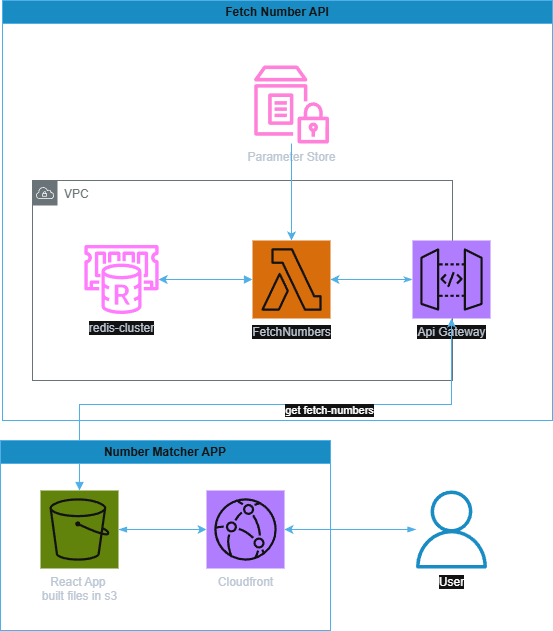

# Serverless - AWS Node.js Typescript

This project has been generated using the `aws-nodejs-typescript` template from the [Serverless framework](https://www.serverless.com/).

For detailed instructions, please refer to the [documentation](https://www.serverless.com/framework/docs/providers/aws/).

## Installation/deployment instructions

- Run `npm i` to install the project dependencies
- Run `npx sls deploy` to deploy this stack to AWS

## Test your service

This project has Jest for unit testing

- Run `npm run test`

## Endpoint

### DEV
GET `https://kso9vgq60c.execute-api.us-east-1.amazonaws.com/dev/fetch-numbers?session-id=<some-session-id>`

Response
```json
{
    "result": [
        2,
        5
    ],
    "history": [
        [
            2,
            4
        ],
        [
            2,
            5
        ]
    ]
}
```

## Architecture


